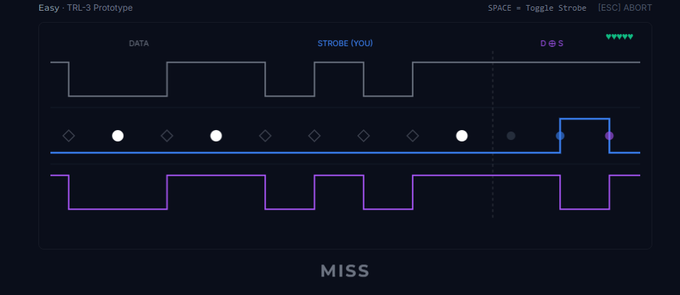
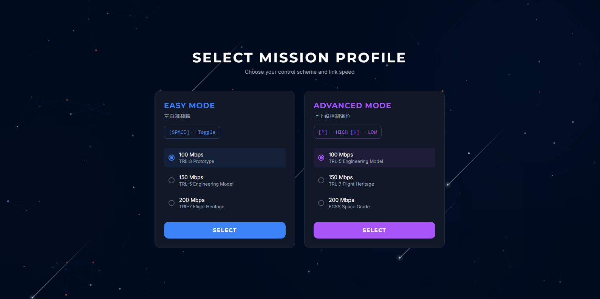
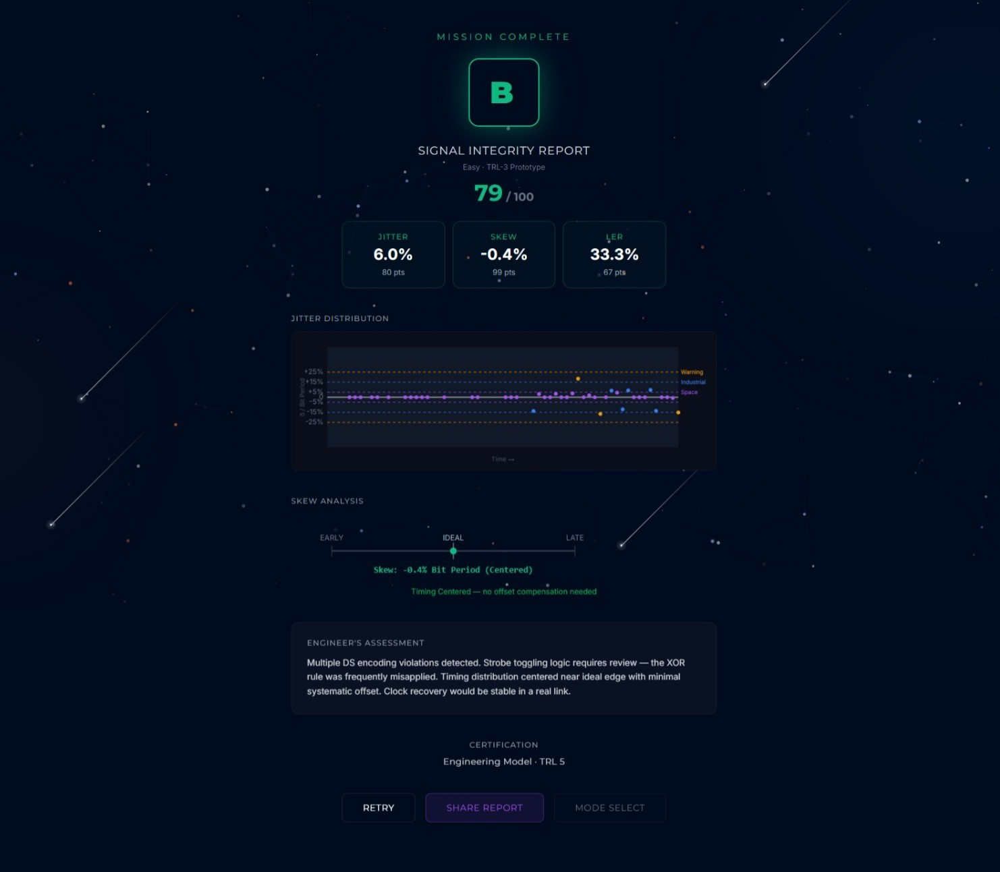

# 🛰️ XORbit: The SpaceWire DS Mechanism Visualizer

**Master the heartbeat of satellite communication.**

👉 **[Launch XORbit to build a physical intuition for Data-Strobe encoding.](https://xorbit.anxplore.space/)**

## 📜 The Mission
In the 500km vacuum of Low Earth Orbit, a single unhandled transition can paralyze a payload. \
To make data survive the stars, we need the **Recovered Clock**.

**XORbit** is an interactive visualizer designed to decode the core mechanism of SpaceWire Data-Strobe (DS) encoding. \
Instead of reading the abstract definitions of the ECSS standard, you will physically execute the logic.\
**Maintain the link. Extract the clock. Prevent the disconnect.**

## ⚙️ The Mechanism: Data-Strobe (DS) Encoding
You are acting as the DS Encoder logic. 

The fundamental rule of SpaceWire DS encoding is simple but absolute: The XOR of Data (D) and Strobe (S) must always yield the clock. \
Data flows automatically, but you must synthesize the Strobe signal.

* **If Data transitions:** Do nothing. Hold the Strobe.
* **If Data stays flat:** Toggle the Strobe.

Miss a cycle, the clock stops. The link drops.

## ⚡ Core Specs

### 📐 Jitter & Timing Analysis
Your performance isn't a "score"—it is a measure of your **Timing Consistency**. Every transition is measured against the bit period.
* Can you maintain **< 5% Jitter (Space Grade)**? 
* Or does your timing decay into **Consumer Grade** noise?

### 🛠️ Interactive Environments
| Environment | Control Logic | Objective |
|------|---------|-------------|
| **Calibration** | `Space` to toggle | Isolate and internalize the DS logical rules. |
| **Full-Rail** | `↑` = HIGH, `↓` = LOW | Manage full dual-rail voltage transitions. |

### 🚀 Telemetry Bitrates
Test your reaction against orbital frequencies:
* **100 Mbps**: System bring-up.
* **150 Mbps**: Operational stability.
* **200 Mbps**: The physical limit.

## 🏆 The Qualification Scale
How consistent is your internal clock? At the end of every run, XORbit compiles a comprehensive **Link Analysis Report**.

* **Space Grade (S)**: Flawless synchronization. 
* **Military Grade (A)**: Highly reliable timing.
* **Industrial Grade (B)**: Stable for Earth-bound testbeds.
* **Consumer Grade (C)**: Functional, susceptible to delay.
* **Prototype (D) / LINK_DOWN**: Link Disconnected. Back to the lab.

### 📊 Telemetry Output
* **Jitter Scatter Plot**: Visualize your phase variation.
* **Skew Distribution**: Identify if your transitions are leading or lagging.
* **Link Error Rate (LER)**: Pinpoint the exact cycle of synchronization failure.

## 🌌 Why XORbit?
Most developers read protocol definitions; hardware engineers need to *feel* the pulses. \
**XORbit** translates the abstract text of the SpaceWire DS mechanism into a visceral, physical execution. 

> You're not playing rhythm. You're keeping a satellite awake.

**Are you ready to sync?** \
👉 **[Start Synchronizing Satellite Now.](https://xorbit.anxplore.space/)**

---
*Built by [Anxplore](https://www.anxplore.space). From 2nm chips to 500km orbit.*\
*Inspired by the ECSS-E-ST-50-12C Standard.*
